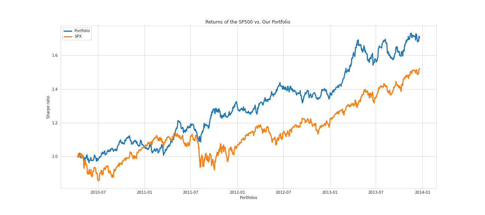

<h1 align="center">Portfolio management </h1>

Portfolio optimisation is the process of allocating capital to different asset
classes by selecting the best asset distribution across a selection of assets to maximize risk-adjusted returns. The traditional approach is based on Modern Portfolio Theory, which optimizes various factors such as returns, Sharpe ratio or risk.
 In this work, we extract latent factors using unsupervised machine learning techniques, and create a portfolio based on these factors. These latent factors can be employed aside from traditional factors such as value or size as an alternative and for diversification purposes.

# Objectives

- Our objective in this work is to use unsupervised machine learning methods on a dataset of stock returns to optimize the risk-adjusted returns of an equity portfolio.

- To assess the efficacy of the strategy, the generated portfolios' performance will be compared to a benchmark and backtested.

# Files
- `utils.py`: python file containing utils functions.
- `Portfolio_management.ipynb`: jupyter notebook with the modeling.
- `sp500.csv` dataset with SP500 components prices.

 
 # Data

The data consists of the adjusted closing price of 410 assets, which constitute the SP500. The data ranges from 2001-2014. The prices can be downloaded using the Yahoo Finance API.

 # Quick Preview

# Conclusion

We presented a systematic approach for constructing factor-free portfolio strategies based on eigen-decomposition. The presented approach is based on eigen decomposing of empirical covariances of stock returns into systematic components. Each component by construction is independent of the others, which can benefit the portfolio with diversification through their inclusion. The first eigen portfolio can be seen as the market factor and has similar behavior to the market. By examining the backtesting result, the portfolio with the highest Sharpe ratio in the training set leads to a portfolio that outperforms the market. By using eigen decomposition, we may obtain independent portfolios with a higher return and Sharp ratio as compared to the market.
